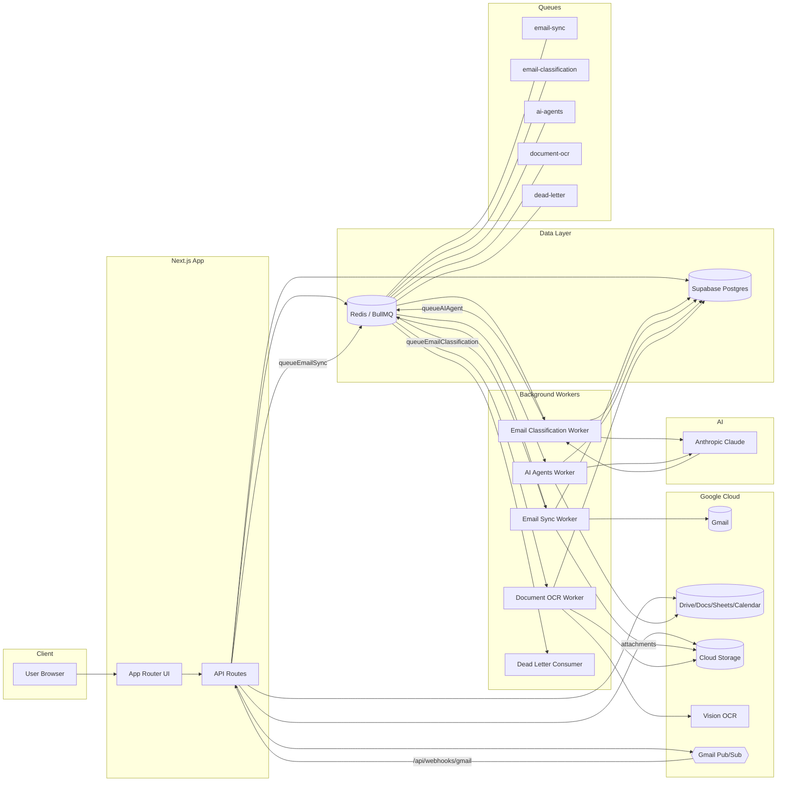
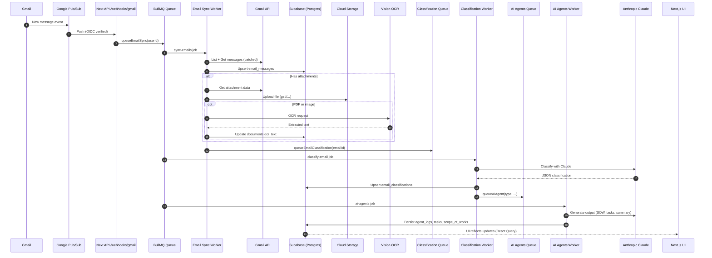

# Technical Architecture

> Note: Canonical version lives in `docs/architecture.md`. This file is retained for continuity and legacy references.

**Version:** 1.0
**Last Updated:** January 2025

---

## System Architecture Diagram

Rendered images (exported from Mermaid sources):

- SVG: ./diagrams/architecture.svg
- SVG (Email flow): ./diagrams/email-processing-sequence.svg

```
┌─────────────────────────────────────────────────────────────────┐
│                         User's Browser                           │
│  ┌────────────────┐  ┌────────────────┐  ┌────────────────┐   │
│  │   Dashboard    │  │  Email Inbox   │  │  Project View  │   │
│  └────────────────┘  └────────────────┘  └────────────────┘   │
└───────────────────────────────┬─────────────────────────────────┘
                                │
                    ┌───────────▼───────────┐
                    │   Next.js Frontend    │
                    │  (Vercel Deployment)  │
                    └───────────┬───────────┘
                                │
                    ┌───────────▼───────────┐
                    │  Next.js API Routes   │
                    │  (Serverless Functions)│
                    └───┬───────────┬───────┘
                        │           │
        ┌───────────────┼───────────┼────────────────┐
        │               │           │                │
┌───────▼──────┐ ┌──────▼─────┐ ┌──▼──────────┐ ┌──▼──────────┐
│   Supabase   │ │ Google APIs│ │ Claude API  │ │ Upstash     │
│  PostgreSQL  │ │  (Gmail,   │ │ (Anthropic) │ │   Redis     │
│     +RLS     │ │ Drive, etc)│ │             │ │  (BullMQ)   │
└──────────────┘ └──────┬─────┘ └─────────────┘ └──────┬──────┘
                        │                               │
                ┌───────▼──────────┐           ┌────────▼───────┐
                │  Google Cloud    │           │  Queue Workers │
                │  Pub/Sub (Gmail  │           │  (Background   │
                │  Push Webhook)   │           │   Processing)  │
                └───────┬──────────┘           └────────────────┘
                        │
                ┌───────▼────────┐
                │ Webhook Route  │
                │ /api/webhooks/ │
                │     gmail      │
                └────────────────┘
```

---

## Mermaid Diagram (Source)

The following Mermaid source mirrors the architecture above and can be rendered with Mermaid tools or at mermaid.live:



---

## Data Flow: Email Processing

```
1. New Email Arrives in User's Gmail
   ↓
2. Gmail Pub/Sub Push Notification
   ↓
3. POST to /api/webhooks/gmail
   ↓
4. Verify Pub/Sub message signature
   ↓
5. Add job to BullMQ: "fetch-email"
   ↓
6. Worker fetches email via Gmail API
   ↓
7. Save to email_messages table
   ↓
8. Download attachments to GCS
   ↓
9. OCR PDFs (if any)
   ↓
10. Add job to BullMQ: "classify-email"
    ↓
11. Worker calls Claude API for classification
    ↓
12. Save to email_classifications table
    ↓
13. Add jobs for each assigned agent
    ↓
14. Agent workers execute in parallel
    ↓
15. Agents create Docs/Sheets/Tasks
    ↓
16. Save results to agent_logs
    ↓
17. Notify user (WebSocket + email digest)
    ↓
18. User reviews and approves/rejects
```

---

## Sequence Diagram (Email Processing)

Rendered version of `docs/diagrams/email-processing-sequence.mmd`:



## Tech Stack Summary

| Component | Technology | Justification |
|-----------|-----------|---------------|
| Frontend | Next.js 16 (App Router), React 19 | Modern, performant, great DX |
| Styling | Tailwind CSS 4 | Rapid development, responsive |
| Language | TypeScript 5 | Type safety, better DX |
| Authentication | NextAuth.js | Google OAuth integration |
| Database | Supabase (PostgreSQL) | Managed, RLS, real-time |
| ORM | Direct SQL (Supabase client) | No Prisma complexity |
| AI | Anthropic Claude 3.5+ | Best reasoning for complex tasks |
| Queue | BullMQ + Upstash Redis | Reliable background processing |
| Google APIs | @google-cloud/* packages | Gmail, Drive, Docs, Sheets, etc |
| File Storage | Google Cloud Storage | Existing, integrated |
| Webhooks | Google Cloud Pub/Sub | Real-time Gmail push |
| Deployment | Vercel | Zero-config, serverless |
| Monitoring | Sentry + Vercel Analytics | Error tracking, performance |
| Payments | Stripe | Standard for SaaS billing |

---

## Infrastructure

**Frontend + API**: Vercel (serverless functions for API routes)
**Database**: Supabase (PostgreSQL with Row Level Security)
**Queue/Redis**: Upstash (serverless Redis for BullMQ)
**Pub/Sub**: Google Cloud Pub/Sub
**File Storage**: Google Cloud Storage (existing bucket)
**Monitoring**: Vercel Analytics, Sentry for error tracking
**Logging**: Vercel Logs + custom logging to Supabase

---

## Environment Variables

- Database URL (Supabase)
- Redis URL (Upstash)
- Google Cloud credentials
- Anthropic API key
- NextAuth secret
- Google OAuth client ID/secret
- Pub/Sub topic/subscription

---

## Deployment Process

1. Push to `main` branch
2. CI runs tests
3. Build on Vercel
4. Run database migrations
5. Deploy to production
6. Health checks
7. Rollback if issues

---

## Monitoring & Observability

### Metrics to Track
- API response times (p50, p95, p99)
- Error rates (by endpoint, by agent)
- Email processing latency
- Queue depth and processing rate
- Database query performance
- User activity (DAU, WAU, MAU)
- Agent success rates
- Classification accuracy

### Alerts
- Error rate >5%
- API response time >10 seconds
- Queue backed up >1000 jobs
- Database connection errors
- Webhook failures

### Dashboards
- System health (uptime, errors, latency)
- User metrics (signups, retention, engagement)
- Agent performance (executions, success rate, avg time)
- Business metrics (emails processed, SOWs generated, time saved)
